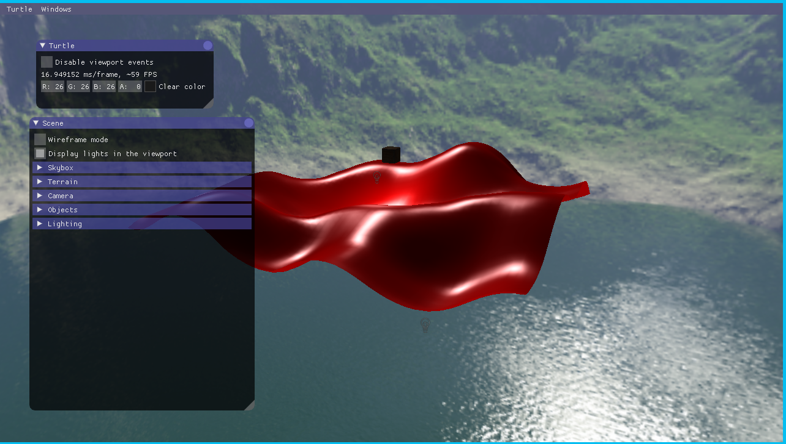
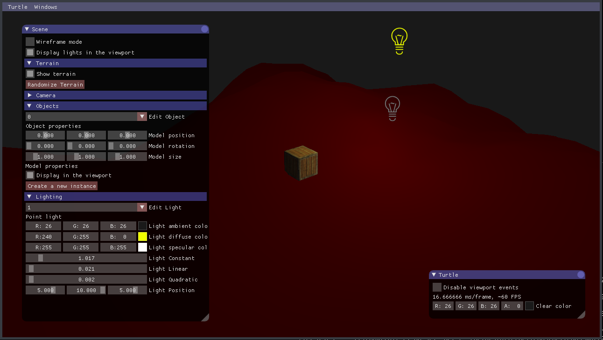
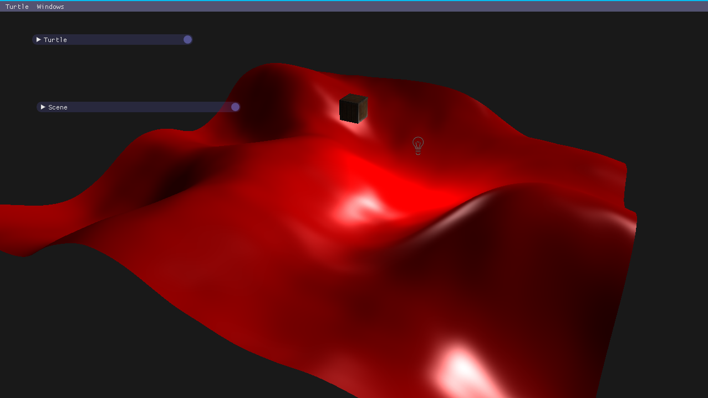
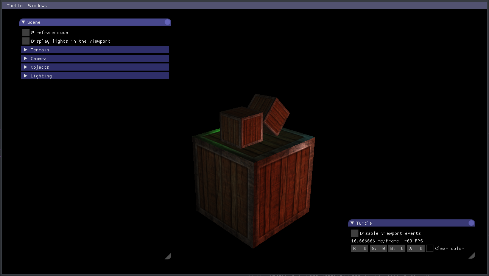
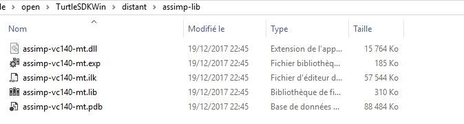

# TurtleSDK

[Documentation](https://oktomus.github.io/TurtleSDK/)

A lightweight and not very usefull SDK created in the will of learning OpenGL 3.3.

## Features

- Model loading
- Orbit camera
- FPS Camera
- Multiple lights
- Terrain generation with perlin noise
- UI with imgui
- Texture loading
- Phong shader
- Object and light transformation
- Object duplication (instancing)
- Billboard (light icons in the viewport)
- Skybox

## Dependencies

Every dependency is managed with git and cmake expect these ones:
- Opengl 3.3 at least
- Python 2.7 or newer (required by gl3w)
- [Assimp](http://assimp.org/)
- [glfw](https://github.com/glfw/glfw)

The dependencies managed by git and cmake are the following:
- [imgui](https://github.com/ocornut/imgui)
- [gl3w](https://github.com/skaslev/gl3w)
- [stb_image](https://github.com/nothings/stb)
- [Perlin_Noise](https://github.com/sol-prog/Perlin_Noise)

## Compile it

**On linux**
	
	# Install dependancies not managed by the repository
    cmake .
    make
	
**On windows with Visual Studio 2017**

- Build assimp and glfw and add generated libs in `distant` `like so

	distant
		...
		glfw
			include/GLFW
				glfw3.h
				...
			lib-vc2012 (just keep this one, delete the others)
				glfw3.lib
				...
		assimp
			include/assimp
				...
			lib
				assimp-vc140-mt.lib
				...
				

You can find assimp source code [here](https://github.com/assimp/assimp/releases/tag/v4.0.1/).
And GLFW pre-builded  libraries [here](http://www.glfw.org/download.html).

**Be sure to compile everython in x64 or in x86. You can't mix various libraries with various architertures.**

- Open the folder with visual studio
- CMake > Generate cache 
- Select TurtleSDK.exe
- Build and run

## Run it

    ./TurtleSDK
