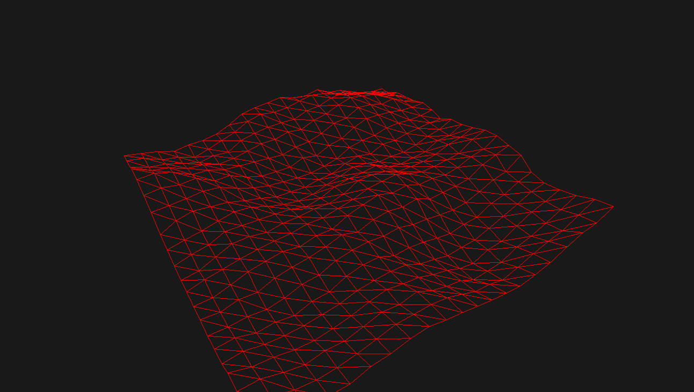

# TurtleSDK

A lightweight and not very usefull SDK created in the will of learning OpenGL 3.3.

## Features

- Model loading
- Orbit camera
- FPS Camera
- Multiple lights
- Terrain generation with perlin noise
- UI with imgui
- Texture loading
- Phong shader
- Object and light transformation
- Object duplication (instancing)
- Billboard (light icons in the viewport)

## Dependencies

Every dependency is managed with git and cmake expect these ones:
- Opengl 3.3 at least
- [Assimp](http://assimp.org/)

The dependencies managed by git and cmake are the following:
- [imgui](https://github.com/ocornut/imgui)
- [glfw](https://github.com/glfw/glfw)
- [gl3w](https://github.com/skaslev/gl3w)
- [stb_image](https://github.com/nothings/stb)
- [Perlin_Noise](https://github.com/sol-prog/Perlin_Noise)

## Compile it

    cmake .
    make

Cmake and git will take care of downloading dependencies.

## Run it

    ./TurtleSDK
